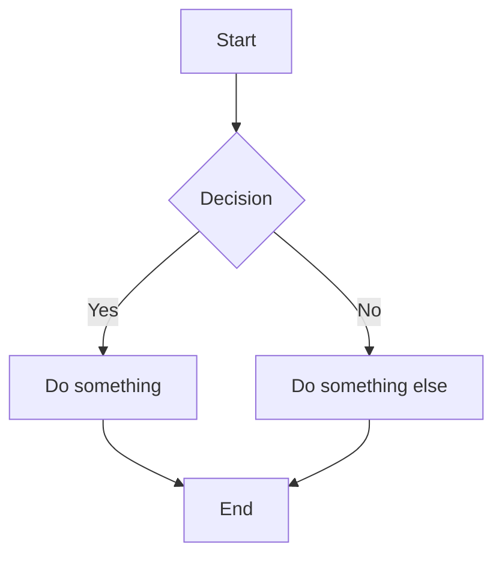
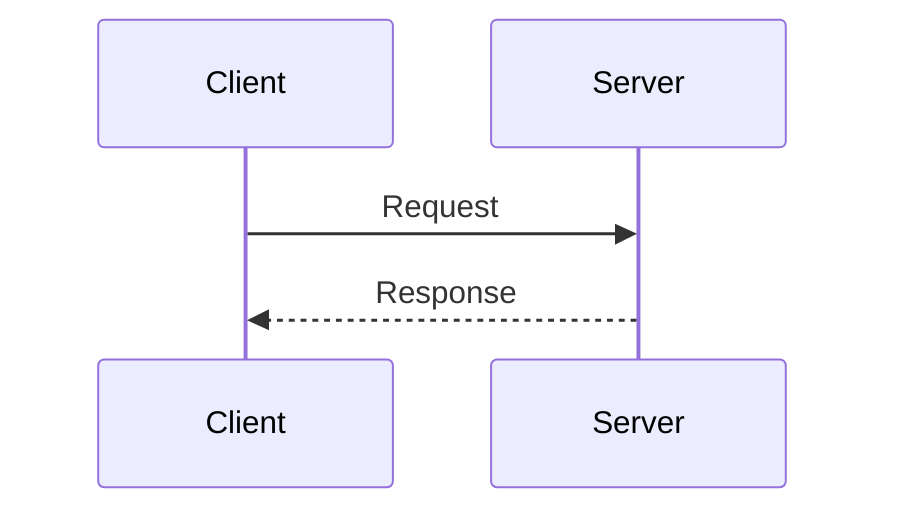
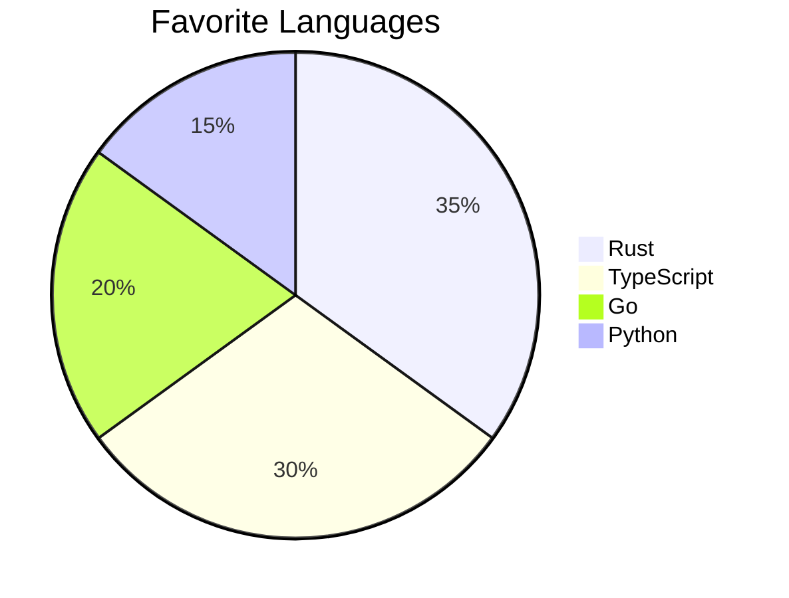

# Markdown Specification Reference

A comprehensive reference covering the original Markdown syntax, the CommonMark
specification, and GitHub Flavored Markdown (GFM) extensions.

---

## Table of Contents

1. [History and Overview](#1-history-and-overview)
2. [CommonMark Specification](#2-commonmark-specification)
   - [Block-Level Elements](#21-block-level-elements)
   - [Inline Elements](#22-inline-elements)
   - [Parsing Algorithm](#23-parsing-algorithm)
3. [GitHub Flavored Markdown -- Formal Extensions](#3-github-flavored-markdown----formal-extensions)
4. [GitHub Platform Features](#4-github-platform-features-beyond-the-gfm-spec)
5. [Feature Comparison](#5-feature-comparison)
6. [References](#6-references)

---

## 1. History and Overview

### Original Markdown (2004)

Markdown was created by **John Gruber** in 2004, with input from **Aaron Swartz**.
It was announced on Gruber's blog, *Daring Fireball*, and released alongside
`Markdown.pl`, a Perl script that converts Markdown to valid XHTML/HTML.

**Design Goals:**

| Goal | Description |
|------|-------------|
| Readability | Plain text should be readable as-is, without visible markup tags |
| Simplicity | Minimal syntax based on email and Usenet formatting conventions |
| Convertibility | Clean output to structurally valid HTML/XHTML |

The original specification was intentionally informal and left many edge cases
ambiguous -- for example, how deeply to indent sub-lists, whether blank lines are
required before block elements, and how nested emphasis markers should be parsed.
This ambiguity led to dozens of divergent implementations where the same Markdown
source rendered differently on different platforms.

### CommonMark (2014--present)

**CommonMark** was created to address these ambiguities. Led by John MacFarlane
(creator of Pandoc) and Jeff Atwood (co-founder of Stack Overflow), it provides:

- An **unambiguous specification** for every syntax construct
- A **comprehensive test suite** (over 600 examples)
- A **reference implementation** in C (`cmark`)
- Current version: **0.31.2** (January 28, 2024)

### GitHub Flavored Markdown

**GitHub Flavored Markdown (GFM)** is a **strict superset of CommonMark**. It adds
a small set of formally specified extensions (tables, strikethrough, task lists,
autolinks, disallowed raw HTML) while maintaining full backward compatibility
with CommonMark. The GFM spec is maintained by GitHub and built on top of the
`cmark` parser.

In addition to the formal GFM spec, the GitHub *platform* supports several
rendering features not part of the GFM specification itself (footnotes, math,
Mermaid diagrams, alerts, etc.).

---

## 2. CommonMark Specification

CommonMark defines two categories of elements: **block-level** (structural) and
**inline** (text-level).

### 2.1 Block-Level Elements

#### Headings (ATX Style)

Use 1--6 `#` characters followed by a space:

```markdown
# Heading 1
## Heading 2
### Heading 3
#### Heading 4
##### Heading 5
###### Heading 6
```

**Setext-style headings** use underlines:

```markdown
Heading 1
=========

Heading 2
---------
```

> **CommonMark note:** A space is required between the `#` and the heading text.
> `#Not a heading` is not valid; `# Heading` is.

#### Paragraphs and Line Breaks

Paragraphs are separated by one or more blank lines. Within a paragraph:

- A **soft break** (single newline) is treated as a space in HTML output.
- A **hard break** requires two trailing spaces or a backslash at the end of a line.

```markdown
This is a paragraph. It can span
multiple lines and they join together.

This is a new paragraph.

This line has a hard break  
created by two trailing spaces.

This line has a hard break\
created by a trailing backslash.
```

#### Blockquotes

Prefix lines with `>`:

```markdown
> This is a blockquote.
> It can span multiple lines.
>
> > Nested blockquotes are supported.
```

#### Lists

**Unordered lists** use `-`, `*`, or `+`:

```markdown
- Item one
- Item two
  - Nested item (indented 2-4 spaces)
  - Another nested item
- Item three
```

**Ordered lists** use a number followed by `.` or `)`:

```markdown
1. First item
2. Second item
   1. Nested ordered item
   2. Another nested item
3. Third item
```

> **CommonMark note:** The starting number of an ordered list matters for the
> first item only. Subsequent numbers are auto-incremented regardless of the
> actual numbers written.

**Loose vs. tight lists:** A list is "loose" if any of its items are separated
by blank lines. Loose list items are wrapped in `<p>` tags; tight list items are
not.

```markdown
- Tight item one
- Tight item two

- Loose item one

- Loose item two
```

#### Code Blocks

**Fenced code blocks** use three or more backticks or tildes:

````markdown
```
function hello() {
  console.log("Hello, world!");
}
```

~~~
Another code block using tildes.
~~~
````

**Indented code blocks** use 4 spaces of indentation (a blank line is required
before them):

```markdown
This is a paragraph.

    This is an indented code block.
    Each line must be indented by 4 spaces.
```

#### Horizontal Rules (Thematic Breaks)

Three or more `-`, `*`, or `_` characters (optionally with spaces):

```markdown
---
***
___
- - -
```

#### HTML Blocks

CommonMark allows raw HTML blocks. It defines 7 types of HTML blocks with
specific start/end conditions. Block-level HTML is passed through as-is:

```markdown
<div class="custom">
  <p>This HTML is passed through directly.</p>
</div>
```

> **CommonMark note:** Markdown syntax is **not** processed inside block-level
> HTML elements.

#### Link Reference Definitions

Reference-style links are defined at the block level:

```markdown
[CommonMark]: https://commonmark.org "CommonMark Official Site"
[gfm]: https://github.github.com/gfm/
```

These definitions are not rendered; they provide targets for reference links used
inline.

### 2.2 Inline Elements

#### Emphasis and Strong Emphasis

```markdown
*italic* or _italic_
**bold** or __bold__
***bold italic*** or ___bold italic___
```

> **CommonMark note:** Underscore-based emphasis has additional rules -- it does
> not work in the middle of a word (`foo_bar_baz` is literal, not emphasized),
> while asterisks do (`foo*bar*baz` emphasizes "bar").

#### Inline Code

Wrap text in backticks:

```markdown
Use the `printf()` function.

To include a literal backtick: `` `code` ``

A code span with multiple backticks: ``` `` nested `` ```
```

#### Links

**Inline links:**

```markdown
[Link text](https://example.com "Optional Title")
```

**Reference links:**

```markdown
[Link text][ref-id]
[Link text][]
[Link text]

[ref-id]: https://example.com "Optional Title"
```

Reference link forms:
- `[text][ref-id]` -- full reference
- `[text][]` -- collapsed reference (ref-id matches link text)
- `[text]` -- shortcut reference (ref-id matches link text)

**Autolinks** (angle-bracket form):

```markdown
<https://example.com>
<user@example.com>
```

#### Images

Same syntax as links, prefixed with `!`:

```markdown

![Alt text][image-ref]

[image-ref]: image.png "Optional Title"
```

#### Character Escapes and Entities

Backslash escapes for ASCII punctuation characters:

```markdown
\* Not emphasis \*
\# Not a heading
\[ Not a link \]
```

HTML entities and numeric character references:

```markdown
&copy; &amp; &#123; &#x7B;
```

### 2.3 Parsing Algorithm

CommonMark uses a **two-phase parsing approach**:

**Phase 1 -- Block Structure:**
- Processes input line by line
- Identifies container blocks (blockquotes, lists, list items)
- Identifies leaf blocks (headings, code blocks, paragraphs, thematic breaks)
- Collects link reference definitions

**Phase 2 -- Inline Structure:**
- Parses inline content within leaf blocks
- Uses a **delimiter stack algorithm** for emphasis resolution
- Resolves reference links against collected definitions
- Processes backslash escapes and character references

**Key principle:** Links are processed before emphasis, which affects how nested
syntax is interpreted.

---

## 3. GitHub Flavored Markdown -- Formal Extensions

GFM adds these extensions to CommonMark. Each is formally specified in the
[GFM Spec](https://github.github.com/gfm/).

### 3.1 Tables

Tables use pipes (`|`) and hyphens (`-`). A header row is required:

```markdown
| Feature     | Supported | Notes           |
| ----------- | :-------: | --------------: |
| Left-align  | Yes       | Default         |
| Center      | Yes       | Use `:---:`     |
| Right-align | Yes       | Use `---:`      |
```

**Column alignment** is controlled by colons in the delimiter row:

| Syntax | Alignment |
|--------|-----------|
| `---` or `:---` | Left (default) |
| `:---:` | Center |
| `---:` | Right |

> **Note:** Cells do not need to be visually aligned in the source. Pipes at the
> start and end of rows are optional but recommended. The number of cells in each
> row should match the header.

### 3.2 Strikethrough

Wrap text in double tildes:

```markdown
~~This text is struck through.~~
```

Renders as: ~~This text is struck through.~~

The GFM spec requires double tildes (`~~`). Some renderers also accept single
tildes (`~`), but this is not part of the formal specification.

### 3.3 Task Lists

Add `[ ]` (unchecked) or `[x]` (checked) after a list marker:

```markdown
- [x] Write the documentation
- [x] Research CommonMark
- [ ] Publish the guide
- [ ] Celebrate
```

On GitHub, these render as interactive checkboxes in issues and pull requests.

### 3.4 Autolinks (Extended)

GFM extends CommonMark's angle-bracket autolinks to also recognize bare URLs
and email addresses:

```markdown
Visit https://github.com for more info.
Contact support@example.com for help.

<!-- CommonMark autolinks still work too -->
<https://example.com>
```

The extended autolink recognizes URLs starting with `http://`, `https://`, or
`www.` without requiring angle brackets.

### 3.5 Disallowed Raw HTML

For security, GFM filters the following HTML tags (they are rendered as literal
text rather than HTML):

- `<title>`
- `<textarea>`
- `<style>`
- `<xmp>`
- `<iframe>`
- `<noembed>`
- `<noframes>`
- `<script>`
- `<plaintext>`

All other HTML tags allowed by CommonMark remain available.

---

## 4. GitHub Platform Features (Beyond the GFM Spec)

These features are supported by GitHub's rendering engine but are **not part of
the formal GFM specification**.

### 4.1 Syntax Highlighting

Fenced code blocks accept a language identifier (info string) for syntax
highlighting:

````markdown
```javascript
function greet(name) {
  return `Hello, ${name}!`;
}
```

```python
def greet(name: str) -> str:
    return f"Hello, {name}!"
```

```rust
fn greet(name: &str) -> String {
    format!("Hello, {}!", name)
}
```
````

GitHub uses [Linguist](https://github.com/github-linguist/linguist) for language
detection and highlighting. Hundreds of languages are supported.

### 4.2 Alerts / Admonitions

GitHub supports callout-style alerts using block quote syntax with a type marker.
Added in 2023.

```markdown
> [!NOTE]
> Useful information that users should know, even when skimming content.

> [!TIP]
> Helpful advice for doing things better or more easily.

> [!IMPORTANT]
> Key information users need to know to achieve their goal.

> [!WARNING]
> Urgent info that needs immediate user attention to avoid problems.

> [!CAUTION]
> Advises about risks or negative outcomes of certain actions.
```

The five supported types are: `NOTE`, `TIP`, `IMPORTANT`, `WARNING`, `CAUTION`.

### 4.3 Footnotes

GitHub added footnote support in **September 2021**:

```markdown
Here is a statement that needs a citation[^1]. And another[^note].

[^1]: This is the first footnote.
[^note]: Footnotes can have arbitrary labels (not just numbers).
    Indented paragraphs are included in the footnote.
```

Footnotes render as superscript links that jump to a list at the bottom of the
document, with back-links to return to the reference point.

### 4.4 Mathematical Expressions (LaTeX)

GitHub added native LaTeX math rendering in **May 2022**, powered by MathJax.

**Inline math** uses single dollar signs:

```markdown
The equation $E = mc^2$ changed physics.

When $a \ne 0$, the solutions are $x = \frac{-b \pm \sqrt{b^2-4ac}}{2a}$.
```

**Display math** uses double dollar signs:

```markdown
$$
\int_0^\infty e^{-x^2} dx = \frac{\sqrt{\pi}}{2}
$$
```

**Fenced code block alternative:**

````markdown
```math
\left( \sum_{k=1}^n a_k b_k \right)^2 \leq \left( \sum_{k=1}^n a_k^2 \right) \left( \sum_{k=1}^n b_k^2 \right)
```
````

> **Known limitation:** Math expressions inside footnotes may not render
> correctly.

### 4.5 Mermaid Diagrams

GitHub renders Mermaid diagrams from fenced code blocks with the `mermaid`
language identifier (introduced 2022):

````markdown

````

````markdown

````

````markdown

````

### 4.6 Collapsed Sections

Use HTML `<details>` and `<summary>` tags to create expandable sections:

```markdown
<details>
<summary>Click to expand</summary>

This content is hidden by default.

- You can use **Markdown** inside the details block.
- Lists, code blocks, and other elements work here.

</details>
```

> **Note:** A blank line is required between the `<summary>` closing tag and the
> Markdown content for the Markdown to be rendered properly.

**Open by default:**

```markdown
<details open>
<summary>This section starts expanded</summary>

Content visible immediately.

</details>
```

### 4.7 Emoji

GitHub supports emoji shortcodes:

```markdown
:+1: :rocket: :warning: :white_check_mark:
```

A full list is available at
[github.com/ikatyang/emoji-cheat-sheet](https://github.com/ikatyang/emoji-cheat-sheet).

### 4.8 SHA and Issue/PR References

GitHub auto-links certain references in comments and issues:

```markdown
<!-- SHA references -->
16c999e8c71134401a78d4d46435517b2271d6ac
user@16c999e
user/repo@16c999e

<!-- Issue/PR references -->
#1
user/repo#1

<!-- Mention a user or team -->
@username
@org/team
```

---

## 5. Feature Comparison

| Feature | Original Markdown | CommonMark | GFM Spec | GitHub Platform |
|---------|:-:|:-:|:-:|:-:|
| Headings (ATX) | Yes | Yes | Yes | Yes |
| Headings (Setext) | Yes | Yes | Yes | Yes |
| Paragraphs | Yes | Yes | Yes | Yes |
| Line breaks | Yes | Yes (clarified) | Yes | Yes |
| Emphasis / Strong | Yes | Yes (clarified) | Yes | Yes |
| Blockquotes | Yes | Yes | Yes | Yes |
| Ordered lists | Yes | Yes (clarified) | Yes | Yes |
| Unordered lists | Yes | Yes | Yes | Yes |
| Inline code | Yes | Yes | Yes | Yes |
| Fenced code blocks | No | Yes | Yes | Yes |
| Indented code blocks | Yes | Yes | Yes | Yes |
| Links (inline) | Yes | Yes | Yes | Yes |
| Links (reference) | Yes | Yes | Yes | Yes |
| Images | Yes | Yes | Yes | Yes |
| Horizontal rules | Yes | Yes | Yes | Yes |
| HTML passthrough | Yes | Yes (7 types) | Yes (filtered) | Yes (filtered) |
| Character escapes | Yes | Yes (clarified) | Yes | Yes |
| **Tables** | No | No | **Yes** | Yes |
| **Strikethrough** | No | No | **Yes** | Yes |
| **Task lists** | No | No | **Yes** | Yes |
| **Extended autolinks** | No | No | **Yes** | Yes |
| **Syntax highlighting** | No | No | No | **Yes** |
| **Alerts** | No | No | No | **Yes** |
| **Footnotes** | No | No | No | **Yes** |
| **Math (LaTeX)** | No | No | No | **Yes** |
| **Mermaid diagrams** | No | No | No | **Yes** |
| **Collapsed sections** | No | No | No | **Yes** |
| **Emoji shortcodes** | No | No | No | **Yes** |
| **SHA/Issue references** | No | No | No | **Yes** |

---

## 6. References

### Specifications

- **Original Markdown** -- [Daring Fireball: Markdown Syntax](https://daringfireball.net/projects/markdown/syntax)
- **CommonMark Spec (current)** -- [spec.commonmark.org/current](https://spec.commonmark.org/current/)
- **CommonMark Spec (0.31.2)** -- [spec.commonmark.org/0.31.2](https://spec.commonmark.org/0.31.2/)
- **GFM Spec** -- [github.github.com/gfm](https://github.github.com/gfm/)

### GitHub Documentation

- [Basic writing and formatting syntax](https://docs.github.com/en/get-started/writing-on-github/getting-started-with-writing-and-formatting-on-github/basic-writing-and-formatting-syntax)
- [Working with advanced formatting](https://docs.github.com/en/get-started/writing-on-github/working-with-advanced-formatting)
- [Writing mathematical expressions](https://docs.github.com/en/get-started/writing-on-github/working-with-advanced-formatting/writing-mathematical-expressions)
- [Creating diagrams](https://docs.github.com/en/get-started/writing-on-github/working-with-advanced-formatting/creating-diagrams)

### Tools and Implementations

- **cmark** (CommonMark reference implementation) -- [github.com/commonmark/cmark](https://github.com/commonmark/cmark)
- **CommonMark tutorial** -- [commonmark.org/help](https://commonmark.org/help/)
- **Linguist** (GitHub's language detection) -- [github.com/github-linguist/linguist](https://github.com/github-linguist/linguist)
- **Mermaid** -- [mermaid.js.org](https://mermaid.js.org/)
- **MathJax** -- [mathjax.org](https://www.mathjax.org/)
